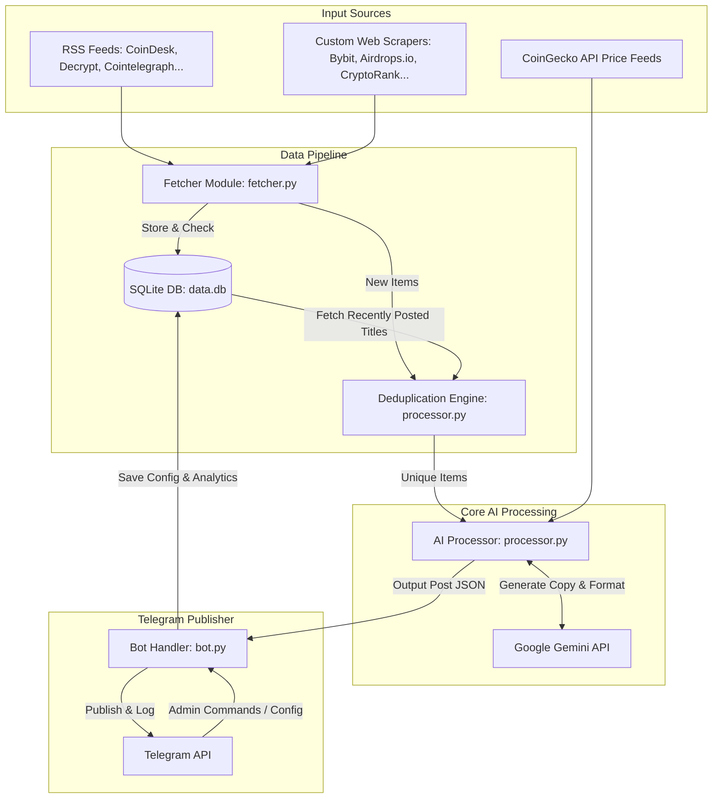

# 📰 Crypto News Telegram Publisher Bot

A fully autonomous, production-ready Telegram bot that aggregates, filters, and publishes cryptocurrency news, custom activities, and daily market analysis. Powered by **Google Gemini API** (using the advanced `gemini-2.5-flash` model), it translates articles, formats them with professional crypto slang, and ensures absolute uniqueness using a smart semantic deduplication engine.

---

## 🚀 Key Features

*   **Multi-Source RSS & HTML Scraper**: Aggregates from a dynamically managed list of RSS feeds and custom HTML scrapers (including Binance, Bybit announcements, airdrops.io, and CryptoRank drop-hunting).
*   **Gemini-Powered Copywriting**: Automatically rewrites news, includes smart AI commentary linking events to market behavior, and formats posts with appropriate emojis and tags.
*   **Semantic Deduplication**: Uses a dual-algorithm approach (Jaccard Similarity over tokenized stems + SequenceMatcher ratio) to prevent double-posting similar topics from different sources.
*   **Dynamic Proxy Rotation**: Integrated rotation mechanism for scraping to avoid rate limits and IP bans.
*   **Custom Activity & Airdrop Guides**: Dedicated formatting for actionable web3 opportunities (airdrops, testnets, giveaways) with step-by-step guides.
*   **Daily Market Analysis**: Automatically generates and publishes daily market columns combining current CoinGecko price data and top news stories.
*   **Subscriber Growth Analytics**: Monitored stats per channel, tracking daily growth metrics and analytics.
*   **Web Server & Keep-Alive**: Built-in HTTP server to pass health checks and keep the script awake on cloud environments like Render.com.

---

## 📊 System Architecture



---

## 🛠️ Tech Stack

*   **Runtime**: Python 3.9+
*   **AI API**: Google Generative AI (Gemini SDK)
*   **Telegram API**: pyTelegramBotAPI
*   **Database**: SQLite (WAL mode for concurrent read/write stability)
*   **Libraries**: BeautifulSoup4, feedparser, requests, python-dotenv

---

## ⚙️ Configuration (.env)

Create a `.env` file in the root directory based on `.env.example`:

```env
# Telegram Bot Configuration
TELEGRAM_BOT_TOKEN=1234567890:ABCdefGhIJKlmNoPQRsTUVwxyZ
TELEGRAM_CHANNEL_ID=-1001234567890

# Google Gemini API Configuration
GEMINI_API_KEY=AIzaSyYourGeminiApiKeyHere

# Posting Language (uk, ru, en)
POST_LANGUAGE=uk

# Owner ID (Optional but recommended to prevent auto-bootstrapping takeover)
OWNER_ID=987654321
```

---

## 🕹️ Telegram Admin Command Interface

The bot provides a secure, interactive admin panel directly inside Telegram for the **Owner** and authorized **Admins**:

| Command | Permission | Description |
|---------|------------|-------------|
| `/start` | Public / Admin | Starts the bot and displays greetings or administrative menus. |
| `/status` | Admin | Shows current bot state, timers, next posts queue, and database stats. |
| `/list_feeds` | Admin | Lists all active RSS feeds and custom scrapers. |
| `/add_feed <name> <url>` | Admin | Dynamically adds a new RSS/scraped source. |
| `/delete_feed <url>` | Admin | Removes an existing feed. |
| `/post_now <news/activity>` | Admin | Manually triggers the fetch and AI post generation cycle immediately. |
| `/daily_analysis` | Admin | Forces generation and posting of the daily market analysis column. |
| `/add_admin <user_id> [username]` | Owner | Authorizes a new administrator. |
| `/delete_admin <user_id>` | Owner | Revokes administrator access. |
| `/list_admins` | Owner | Lists all registered admins. |
| `/backup_db` | Owner | Securely sends the database backup file (`data.db`) to the owner. |

---

## 📦 Installation & Setup

1.  **Clone the repository**:
    ```bash
    git clone https://github.com/Deksterorigin/crypto-news-tg-bot.git
    cd crypto-news-tg-bot
    ```

2.  **Install dependencies**:
    ```bash
    pip install -r requirements.txt
    ```

3.  **Setup environment variables**:
    ```bash
    cp .env.example .env
    # Edit the .env file with your tokens and IDs
    ```

4.  **Run the bot**:
    ```bash
    python bot.py
    ```

5.  **Verify using test scripts**:
    *   Test Telegram Channel Posting: `python test_post.py`
    *   Test Feeds Aggregator: `python test_fetcher.py`
    *   Test Gemini Copywriting & Generation: `python test_processor.py`
    *   Run all unit tests: `python -m unittest test_features.py`
